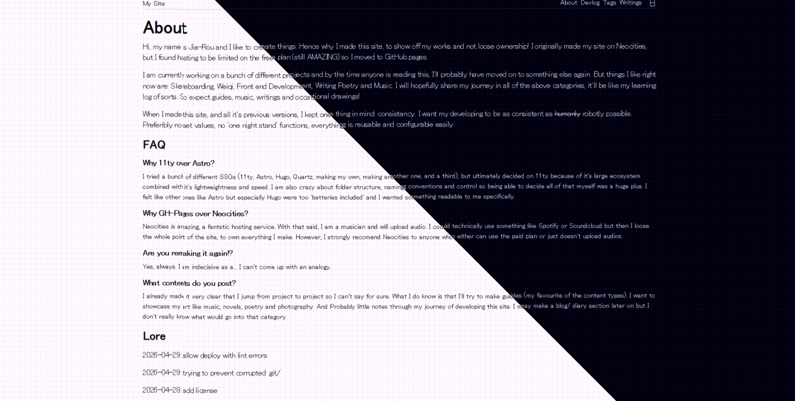

# jiaroustille.github.io



## Welcome!
Hello! This is the source code for my personal website, built with Eleventy and deployed through GitHub Pages.

## Stack

- Eleventy
- Node 22.22.2
- Git and Github
- Community plugins for Eleventy
- ESlint
- VScode

## Structure

```
src:\
│
│   humans.txt.njk
│   index.md
├───content
│   │   devlog.md
│   │   tags.md
│   │   writings.md
│   │   
│   ├───devlog/
│   └───writings/
├───_11ty/
│   ├───plugins/
│   └───shortcodes/
├───_data/
│       site.js
└───_includes/
    ├───passthrough/
    │   ├───img/
    │   └───styles/
    ├───scripts/
    └───_layouts/
```

## Licensing

- **Code:** MIT  
- **Content:** All Rights Reserved

---

<a href="https://jiaroustille.github.io/rss.xml">
  
</a>
